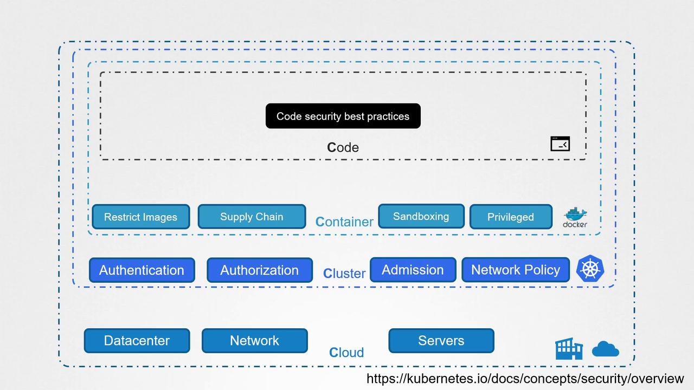

# The 4Cs of Cloud Native Security

1. Cloud
2. Cluster
3. Container
4. Code

---

## Cloud Security
- The first "C" is Cloud Security, which focuses on protecting the overall infrastructure - be it a public cloud, private cloud, on-premise data center, or co-located environment.
- Ensure that your cloud infrastructure includes robust network firewalls and proper access controls. This is not only essential for preventing unauthorized access but also for mitigating broader risks that can stem from exposed ports.

---

## Cluster Security
- The second "C" focuses on securing the Kubernetes Cluster itself.
- The attacker can compromised the system by exploiting a publicly accessible Docker daemon and an unsecured Kubernetes dashboard that lacked proper authentication and authorization measures.
- To secure the cluster:
    - Follow best practices to protect the Docker daemon.
    - Secure the Kubernetes API by enforcing strong access controls.
    - Restrict dashboard access with proper authentication.
    - Implement network policies and ingress security for additional safeguard measures.

---

## Container Security
- The third "C" addresses Container Security.
- The absence of constraints on image sources or tags can allow the deployment of potentially harmful containers and unapproved applications.
- To mitigate these risks:
    - Enforce policies that allow only images from secure, trusted repositories.
    - Disallow privileged mode for containers.
    - Use container sandboxing to provide an additional layer of security.

---

## Code Security 
- The final "C" focuses on Code Security.
- Although not the main focus for this course, securing application code remains critical. 
- Common pitfalls include hard coding credentials, passing sensitive information via environment variables, or transmitting data without TLS encryption.
- Key recommendations include:
    - Implement Secrets Management and vault solutions for critical information.
    - Enable mTLS encryption to ensure secure communication between pods.

---

