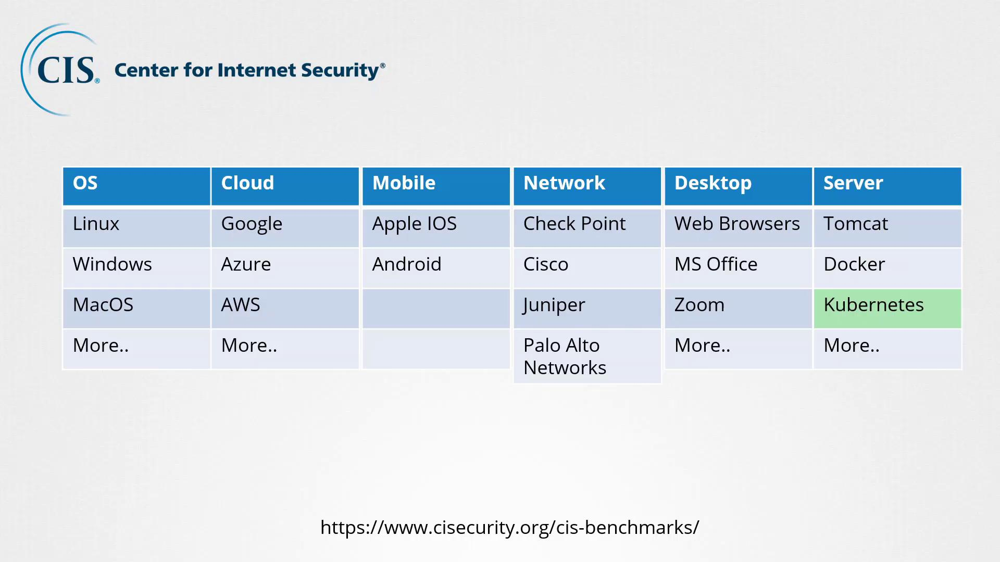
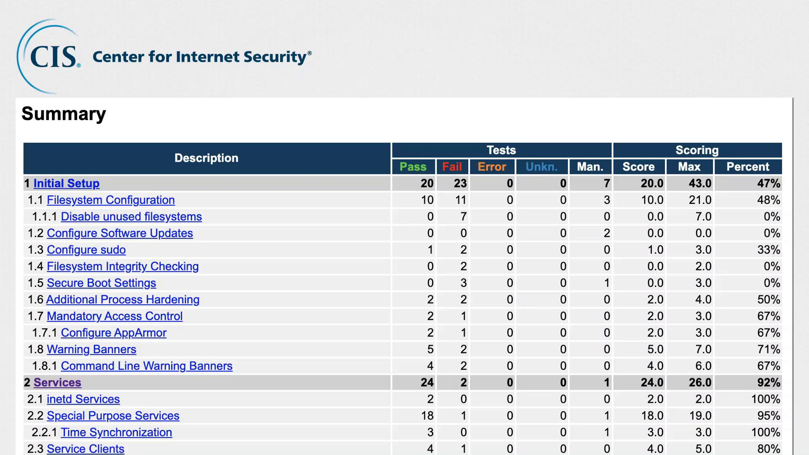
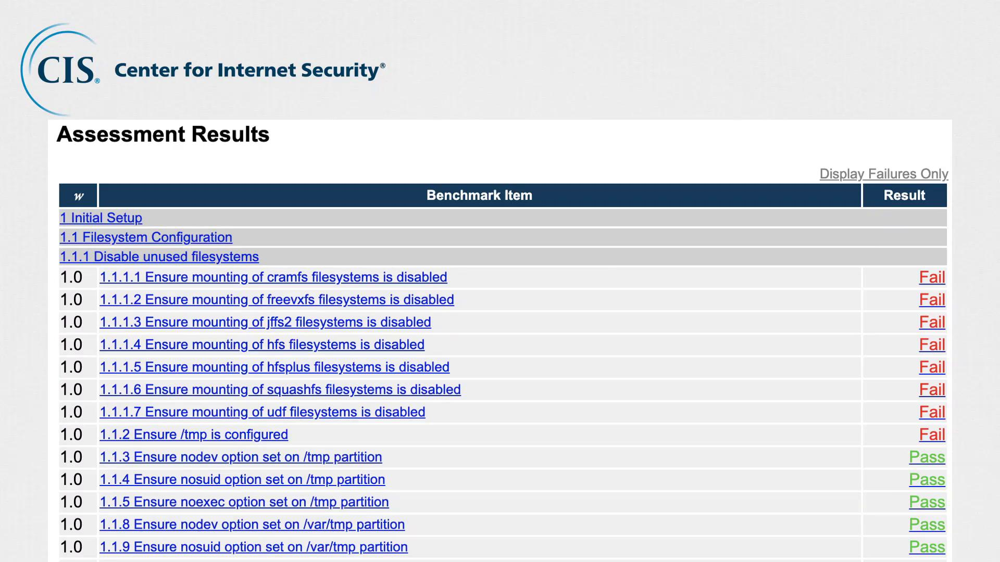

# Understanding Security Benchmarks
- Before applying CIS Benchmarks, it's important to understand what security hardening means. 
- Security hardening involves configuring systems (e.g., a fresh Ubuntu 18.04 server) to reduce vulnerabilities before running production workloads.

## Why Hardening Matters:
- Prevent unauthorized access (e.g., disabling unused USB ports).
- Avoid root login; use individual user accounts with sudo for accountability.

## Key Security Best Practices:
- Allow sudo access only to trusted users.
- Configure firewalls/IPTables to permit only required traffic.
- Disable non-essential services; keep critical ones (e.g., NTP) running.
- Apply strict file permissions; disable unused file systems.
- Enable auditing and logging for visibility and intrusion detection.

---

# Introduction to CIS Benchmarks
- **CIS (Center for Internet Security)** is a nonprofit organization that provides community-driven security best practices to improve cybersecurity across systems and platforms. 
- Their goal is to promote a safer digital world by offering actionable security guidelines known as CIS Benchmarks.

## CIS Benchmarks Cover:
- **Operating Systems:** Linux, Windows, macOS
- **Public Cloud:** AWS, Azure, Google Cloud
- **Mobile Platforms:** Android, iOS
- **Network Devices:** Cisco, Palo Alto, Juniper, Check Point
- **Desktop Software:** Web browsers, MS Office, Zoom
- **Server Software:** Tomcat, Nginx, etc.
- **Virtualization & Containers:** VMware, Docker, Kubernetes

## What’s Included in a CIS Benchmark?
- Each CIS Benchmark provides comprehensive, practical security guidance, including:
    - **Risk Explanation:** Why certain configurations are insecure.
    - **Verification Steps:** Commands to check current settings (e.g., modprobe -n -v usb-storage to verify USB storage configuration).
    - **Remediation Procedures:** Clear instructions to fix non-compliant settings.
- These step-by-step recommendations help system admins assess, harden, and secure systems effectively.

> [!NOTE]
> - CIS not only provides these best practices but also offers tools for automated assessments. 
> - The CIS CAT (Configuration Assessment Tool) automates the process of comparing your server's configuration against CIS benchmarks and generates a comprehensive HTML report.

- The CIS CAT report summarizes which security recommendations have been implemented and identifies areas requiring attention.

- This assessment displays which tests passed and which failed, along with corresponding scores for each category. Users can click on each group for a detailed breakdown of the results.

